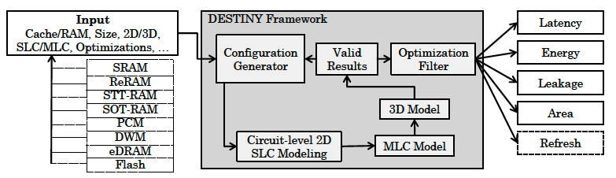

huje muje dziekie weze

# DESTINY: 3D Design-Space Exploration Tool

DESTINY (3D dEsign-Space exploraTIon Tool for SRAM, eDRAM and Non-volatile memorY) is a comprehensive modeling tool for both conventional and emerging memory technologies. It extends the capabilities of tools like CACTI, CACTI-3DD, and NVSim to provide extensive 3D memory modeling capabilities.

## Features

DESTINY can model:
- **2D/3D Memory Technologies:**
  - SRAM and eDRAM
  - STT-RAM, ReRAM, and PCM (2D/3D, SLC/MLC)
  - SOT-RAM, Flash, DWM (2D, SLC/MLC)

- **Key Capabilities:**
  - Support for 22nm to 180nm technology nodes
  - Comprehensive modeling of conventional and emerging memories
  - Validated against commercial prototypes
  - Fine and coarse-grained TSV modeling
  - Multi-level cell support

For more details refer to [DESTINY publication](docs/literature/2015_DESTINY%20-%20A%20Comprehensive%20Tool%20with%203D%20and%20Multi-Level%20Cell%20Memory%20Modeling%20Capability.pdf)

## Installation

DESTINY is developed in C++ and can be compiled on both Microsoft Windows and Unix-like operating systems.

### Prerequisites
- C++ compiler (GCC recommended)
- Make build system

### Building on Linux
```bash
# Clone the repository
git clone https://github.com/jjastrz14/Destiny-Memory-simulator
cd Destiny-Memory-simulator

# Build the project
make
```
## Usage

Run DESTINY with example configuration file:
```bash
$ ./destiny
```

For user-defined configuration files in a different directory:
```bash
$ ./destiny <path-to/file>.cfg
```

For configuration files in config folder you can also: 
```bash 
$ cd config 
$ ../destiny <file.cfg>
``` 
Assuming that <file>.cfg is present in the topfolder/config folder, whereas "destiny" binary is present in "topfolder".
Remember: .cfg file can refer to the another .cell file, so the exact path for .cell file needs to be provided in .cfg file. 

## Running First Simulation

To develop your first simulation:

1. **Prepare Configuration Files**
   - Create .cell and .cfg files according to available input options
   - See: [Configuration Parameters](#configuration-parameters)

2. **Run Simulation**
   - Use single run command or
   - use bash script available in `/scripts` for multiple simulations

3. **Collect Results**
   - Output is provided in:
     - Terminal output
     - Single .csv file (stored in `/results/type-of-technology`)
   - For multiple simulations, use our [dataset concatenation script](scripts/dataset_concatenate.py)

## Result Processing
The dataset concatenation script requires:
- Python with numpy and pandas libraries
- Correct path and naming convention setup
- Outputs multiple .csv files based on your data requirements

This DESTINY's version provides you output in terminal and also as single .csv file stored in /results/type-of-technology (sorted by memory technology). If you run several simulations you might want to concatanate .csv-s into one file. To do this use [Python-script](scripts/dataset_concatenate.py) changing the naming convention and path to files in the .py before. Script is able to provide you several csv files depending on data which our are intrested in. First .csv is always a full summary and next ones can be defined in the code. To run this script you need numpy and pandas libraries.

To understand the output of the destiny refer to: 
- [Documentation](docs/literature/2015_DESTINY_Documentation.pdf)

To understand the structre and logic of the simulator refer to:
- [CACTI](docs/literature/2008_CACTI_5.1_technical_report_HPL.pdf) - introduces the core of the source code, main concepts of the design of memory array  
- [NVsim](docs/literature/2012-NVsim-TCAD.pdf) - introduces the nonvolatile technologies to CACTI code
- [DESTINY](docs/literature/2015_DESTINY%20-%20A%20Comprehensive%20Tool%20with%203D%20and%20Multi-Level%20Cell%20Memory%20Modeling%20Capability.pdf) - DESTINY's publication

## Configuration Parameters

To understand possible parameters which can be defined in .cfg and .cell files please refer to: 
- [Configuration parameters](docs/cfg_parameters.md)
- [Cell parameters](docs/cell_parameters.md)

Where more or less all possible input parameters where collected. 

## Parameters Search Space 

Before running DESTINY simulations, you can explore valid configuration parameters using our search space analysis tools. These tools help you:

- Determine proper memory capacity values
- Validate wordwidth parameters
- Analyze possible mat organizations
- Avoid configuration errors in DESTINY

### Search Space Tools

We provide two implementations for search space analysis:
- [Python Implementation](scripts/DESTINY_search_space.py)
- [MATLAB Implementation](scripts/DESTINY_search_space.m)

These tools are particularly useful when:
- Working with specific memory designs
- Requiring fixed mat organization
- Need to prevalidate configuration parameters
- Want to explore possible design spaces before simulation

The DESTINY search space script allow for preexamination of the possible capacity values, wordwidth and mats organisation (which are later defined in the configuration files). This scripts are suggestions for possilbe inputs in .cfg files. 

## Support

### Official Channels
- Mailing List: destiny-help@elist.ornl.gov
- Archive: [Previous Discussions](https://elist.ornl.gov/pipermail/destiny-help/)

### Repository Maintainer
- Email: jakubandrzej.jastrzebski@polimi.it

## Citing This Work

If you use DESTINY in a research publication, authors request you to cite any of the these publications. 

```bibtex
@article{mittal2017destiny,
  title={DESTINY: A Comprehensive Tool with {3D} and Multi-level Cell Memory Modeling Capability},
  author={Mittal, Sparsh and Wang, Rujia and Vetter, Jeffrey},
  journal={Journal of Low Power Electronics and Applications},
  year={2017},
  publisher={MDPI}
}

@techreport{mittal2014exploring,
  title={Exploring Design Space of {3D} {NVM} and {eDRAM} Caches Using {DESTINY} Tool},
  author={Mittal, Sparsh and Poremba, Matthew and Vetter, Jeffrey S and Xie, Yuan},
  year={2014},
  institution={Oak Ridge National Laboratory},
  number={ORNL/TM-2014/636},
  url={http://goo.gl/qzyWFE}
}

@inproceedings{poremba2015destiny,
  title={{DESTINY}: A Tool for Modeling Emerging {3D} {NVM} and {eDRAM} caches},
  author={Poremba, Matthew and Mittal, Sparsh and Li, Dong and Vetter, Jeffrey S and Xie, Yuan},
  booktitle={Design, Automation \& Test in Europe Conference \& Exhibition (DATE)},
  year={2015},
  url={http://goo.gl/3nKAM2}
}
```

The JLPEA 2017 paper describes DESTINY in full detail and also shows its use in performing design-space exploration.

Support for DESTINY is provided on a best-effort basis. For receiving announcements,
 or sending questions and comments, please subscribe to the mailing list
 destiny-help@elist.ornl.gov by visiting the following 
webpage: https://elist.ornl.gov/mailman/listinfo/destiny-help 

check: [Get in touch](##get-in-touch)


## Sponsors

- Science and Engineering Research Board (SERB), India (ECR/2017/000622)
- Office of Advanced Scientific Computing Research, U.S. Department of Energy


## License and Disclaimer

This is not a Politecnico di Milano product.

Copyright 2024 Politecnico di Milano.

### Source Code License
This software is licensed under BSD-style licenses from multiple source projects. See the [LICENSE](LICENSE) file for detailed terms and conditions.

[](LICENSE)

## Acknowledgments

DESTINY utilizes frameworks from:
- NVSim (2D SRAM and 2D NVM modeling) see: [NVsim](docs/literature/2012-NVsim-TCAD.pdf)
- CACTI-3DD (TSV modeling) see: [CACTI-3DD](docs/literature/CACTI-3DD_Architecture-level_modeling_for_3D_die-stacked_DRAM_main_memory.pdf)

## Get in touch

For technical support or questions regarding this repository: jakubandrzej.jastrzebski@polimi.it
